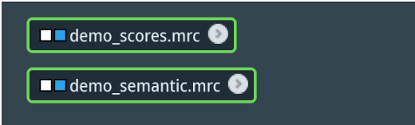

# Guide to Amira

🎥 [Watch the Amira Video Tutorial on YouTube](https://youtu.be/yl-nqEb0eNE)

## Import and Set-Up

**1. Import MemBrain Scores File**

Open a new project. Click the “Open Data” button in the top left. Import the MemBrain 
segmentation scores file (e.g. *_scores.mrc). You can right click this and select Ortho Slice 
from the Amira toolbox to visualize the imported volume

**2. Import TARDIS Microtubule Semantic File**

Click the “Open Data” button again. Import the TARDIS output segmentation (e.g. 
*_semantic.mrc).

***Note**: This file must be in the **int16 format** to ensure proper compatibility with Amira's segmentation tools. If it is not already in this format, you will need to convert it before import.*

  
   
  <em>Above: you should now have two files imported</em>

**3. Generate Ortho Slices to Visualize**

Select one of the imported .mrc files. Right click on the file to open the modules dialog. In 
the left-side menu of the dialog, click *Display*. Then, in the menu to the right, select *Ortho 
Slice* and click *Create*. You should now be able to see the selected tomogram in the viewer. 
Use the slice number slider in the Properties panel on the bottom left to scroll through the z-slices of the tomogram.

The blue box in the orange Ortho Slice module (to the left of the words “Ortho Slice”) 
indicate which tomogram is currently displayed. To turn off and on a tomogram’s display, 
click the blue box (to turn to a gray (inactive)), and click the gray box on the inactive 
tomogram (to turn to blue).

## Segmentation with the Magic Wand
